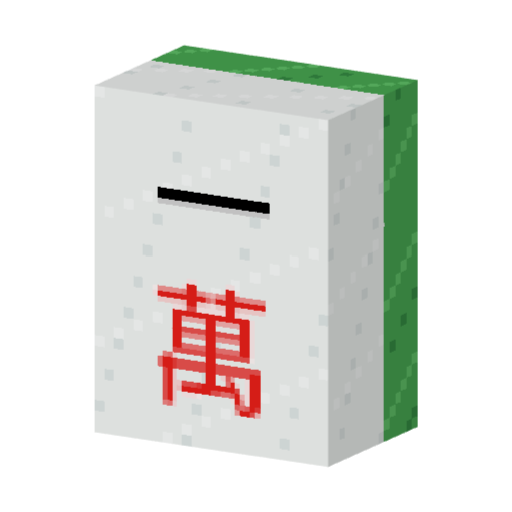

<p align="center"></p>
<h1 align="center">MahjongCraft  <br>
	<a href="https://www.curseforge.com/minecraft/mc-mods/mahjongcraft"></a>
	<a href="https://modrinth.com/mod/mahjongcraft"></a>
	<br>
</h1>

MahjongCraft is a Kotlin Multiplatform mahjong rules engine and an in-development Minecraft mod. The current playable platform target provides Japanese mahjong on Fabric for Minecraft 1.20.1, backed by reusable logic, flow, AI, persistence, networking, and extension modules.

The project is under active development. This documentation describes the code that exists today and does not promise future rules, platforms, interfaces, or release schedules.

## 🗺️ Project map

| Area | Purpose |
| --- | --- |
| [Mahjong logic](mahjong-logic/README.md) | Platform-independent tiles, table state, scoring, and rule modules. |
| [Mahjong flow](mahjong-flow/README.md) | Application state, client/server orchestration, networking, and persistence boundaries. |
| [Mahjong AI](mahjong-ai/README.md) | Pluggable AI strategies for gameplay and round preparation. |
| [Extension API](mahjong-extension-api/README.md) | Public registration surface for third-party MahjongCraft extensions. |
| [Platforms](platform/README.md) | Runtime adapters, currently including Minecraft. |
| [Testing](testing/README.md) | Shared test fixtures for logic and flow modules. |
| [Build logic](build-logic/README.md) | Gradle conventions and platform-target selection. |

## 🛠️ Building

Run a core-only build with:

```shell
./gradlew build
```

Run the current Minecraft Fabric build with:

```shell
./gradlew build -PmahjongcraftTarget=minecraft-v1.20.1-fabric
```

See [CONTRIBUTING.md](CONTRIBUTING.md) for development setup, target selection, conventions, and verification commands.

## 📄 License

MahjongCraft is available under the [MIT License](LICENSE).

## 💬 Support
Please report any issues to [the issue tracker](https://github.com/doublemoon1119/MahjongCraft/issues) on Github.

我是臺灣人，除了英文以外你也可用中文發表 [問題](https://github.com/doublemoon1119/MahjongCraft/issues) 或留言
